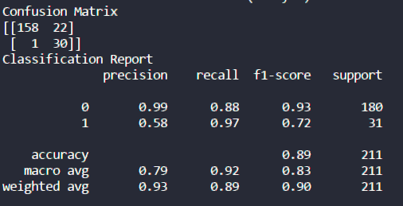
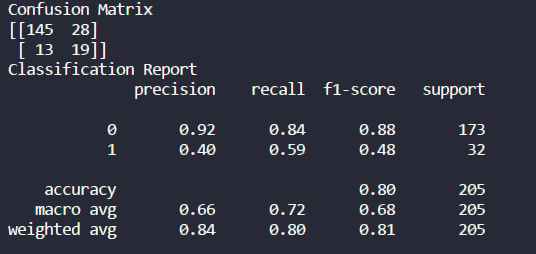
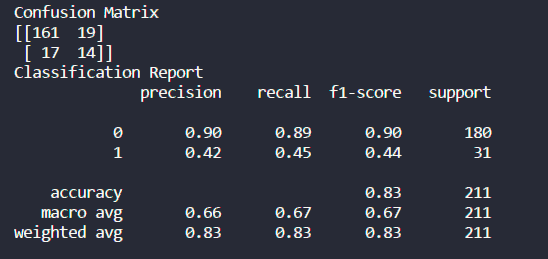
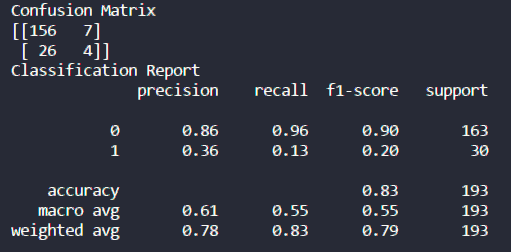
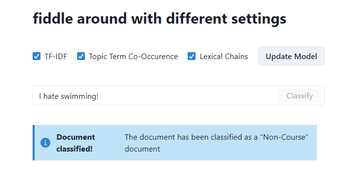

# IR-Assignment-3

## Description
This IR Assignment requires students to:
- Perform feature selection, using 4 approaches
- Perform text classification, using Naive Bayes

### Feature Selection
For feature selection, the 4 approaches outlined are:
- Term-Freq/Inverse-Doc-Freq (tf * idf); Select top 100 features based on tf-idf score. (tf, df frequency thresholds can be adjusted)
- Topic Terms co-occurrence; Find top 50 most frequent nouns, call this a Topics base-set. Then find all co-occurences of terms in the Topic base-set, and append each co-occurence in a relevant topic set.
- Lexical Chains; lexical chains is a sequence of related words, that can span either a few sentences (or neighbouring words), or an entire text. (Threshold for choosing lexical chains can be adjusted)
- All the aforementioned features in combination

### Dumps
All of the intermediate feature spaces and objects have been _pickled_ for later use. `-x-x-x` at the end of the `.pickle` file name indicates which feature selection mechanism was being used to produce it. The three values correspond to `-TFIDF-TTC-LEXCHAINS`, which are the aforementioned feature selection mechanism.

### Heuristics
A few heuristics have been used to speed up the generation of feature spaces and vectors.

### Class Imbalance
The class imbalance has been ignored, but it has contributed majorly to the poor results on `course` class' evaluative metrics

### Screenshots
#### Using only TF-IDF

#### Using only Topic Terms Co-Occurence

#### Using only Lexical Chains

#### Using all three combined

### Frontend (GUI)

## Author
|  |
  :---: 
| [shaheer-2000 (19K-0233)](https://github.com/shaheer-2000) |
